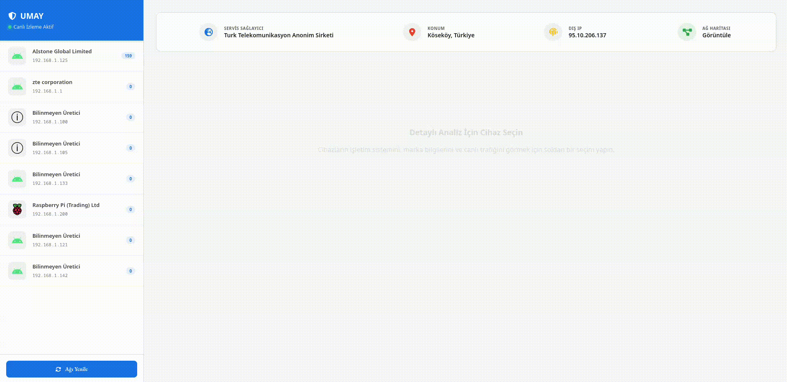

<div align="center">
  
  <h1>Umay Sentinel</h1>
  <p><b>Advanced Network Security, Traffic Analysis & Spatial Visualization System</b></p>

  [](https://github.com/erogluyusuf/Umay)
  [](#)
  [](https://github.com/erogluyusuf/Umay/releases/latest)
  [](LICENSE)
  <br>
  
  
  
</div>

---

##  About The Project / Proje Hakkında

**🇬🇧 English:** **Umay Sentinel** is a high-performance network monitoring, reconnaissance, and visualization framework. By bridging the gap between low-level packet sniffing and high-level mobile visualization, Umay provides an analytical perspective on network privacy and data flow. Designed for cybersecurity professionals, it operates on a resilient **Dual-Mode Architecture**, functioning either as a centralized intelligence hub via a WireGuard VPN or as a standalone tactical local scanner.

**🇹🇷 Türkçe:** **Umay Sentinel**, yüksek performanslı bir ağ izleme, keşif ve görselleştirme sistemidir. Düşük seviyeli paket yakalama (sniffing) ile üst seviye mobil görselleştirmeyi birleştiren Umay, ağ gizliliği ve veri akışı üzerinde analitik bir perspektif sunar. Siber güvenlik uzmanları için tasarlanan sistem, dirençli bir **Çift Modlu Mimari (Dual-Mode)** ile çalışır; WireGuard VPN üzerinden merkez bir istihbarat üssü olarak veya bağlantı koptuğunda bağımsız bir taktiksel yerel ağ tarayıcısı olarak görev yapabilir.

---

##  Download / İndir

** Ready-to-use APK:** You don't need to build the mobile application from source! You can directly download the latest pre-built **Android APK** from the [Releases](https://github.com/erogluyusuf/Umay/releases/latest) page.

** Hazır APK İndir:** Mobil uygulamayı sıfırdan derlemenize gerek yok! Doğrudan en güncel **Android APK** dosyasını [Releases (Sürümler)](https://github.com/erogluyusuf/Umay/releases/latest) sekmesinden tek tıkla cihazınıza indirebilirsiniz.

---

##  System Architecture & Features / Sistem Mimarisi ve Özellikler

Umay consists of two main components communicating over a secure tunnel. The system gracefully falls back to local reconnaissance if the server connection drops.

### 1. Umay Server Node (`server_linux/`)
The backbone of the intelligence operation. It acts as a central router and packet sniffer.

<div align="center">
  
</div>

* **WireGuard Integration:** Automatically creates a secure VPN tunnel, routing all client traffic through the `wg0` interface.
* **Scapy Sniffer Engine:** Deep packet inspection engine written in Python. It captures UDP/53 (DNS) queries to track which domains target devices are communicating with.
* **FastAPI & WebSockets:** Exposes REST endpoints for auto-provisioning devices and utilizes WebSockets to stream intercepted traffic to the mobile dashboard with near-zero latency.

### 2. Umay Mobile Client (`client_mobile/`)
The tactical dashboard used for real-time visualization and on-the-go network reconnaissance.

<div align="center">
  
</div>

* **Live Traffic Flow:** Visualizes intercepted packets and domain requests in a real-time, Matrix-style terminal.
* **Dynamic Topology Mapping:** Automatically fingerprints connected devices, extracts brand intelligence (Apple, Samsung, etc.), and renders a live circular interactive network map.
* **Local Radar Mode (Standalone):** If the VPN/Server drops, the app autonomously switches to Local Mode. Without needing root access, it uses native ICMP pings and TCP Socket connections to perform active host discovery and port scanning on the current Wi-Fi subnet.

---

##  Project Structure / Proje Yapısı

```text
Umay/
├── client_mobile/       # Flutter Application Source Code (Frontend)
├── docs/                # Technical Documentation & Guides
│   ├── gif/             # UI Previews & Logos
│   ├── API_ENDPOINTS.md # REST & WebSocket API Documentation
│   ├── ARCHITECTURE.md  # Deep dive into system design
│   └── SETUP_GUIDE.md   # Step-by-step installation instructions
├── server_linux/        # Python FastAPI Server, Scapy Sniffer Engine
├── vpn_config/          # Auto-generated WireGuard Client configs (.conf)
├── docker-compose.yml   # Container Orchestration config
├── install.sh           # Automated Installation & Setup Script
├── .env                 # Environment variables (Generated during setup)
└── README.md            # You are here
```
---

##  Installation & Setup / Kurulum ve Başlangıç

### Step 1: Server Deployment (Sunucu Kurulumu)
Umay features an automated setup script that configures the Python environment, Docker containers, and the WireGuard infrastructure. *(Requires Ubuntu/Debian based Linux distribution with Root privileges).*

```bash
# Clone the repository
git clone [https://github.com/erogluyusuf/Umay.git](https://github.com/erogluyusuf/Umay.git)
cd Umay

# Make the installer executable and run it as root
chmod +x install.sh
sudo ./install.sh

# Start the backend services in detached mode
docker-compose up -d
```

*After installation, check the `vpn_config/` directory for your client VPN configuration files.*

### Step 2: Mobile Client Setup (Mobil İstemci Kurulumu)
* **Option A:** Download the pre-built APK from the [Releases](https://github.com/erogluyusuf/Umay/releases/latest) page.
* **Option B:** Build from source using Flutter:

```bash
cd client_mobile

# Install Flutter dependencies
flutter pub get

# Create a .env file and set your server URL
echo "SENTINEL_API_URL=http://YOUR_SERVER_IP:8000" > .env

# Run the app on a connected device
flutter run
```
##  Documentation / Dokümantasyon

For advanced configuration, please refer to the documents below: / *Gelişmiş yapılandırmalar için aşağıdaki belgelere göz atın:*

| Resource / Kaynak | Description / Açıklama |
| :--- | :--- |
| [Setup Guide](./docs/SETUP_GUIDE.md) | Detailed installation, VPN setup, and environment preparation. |
| [Architecture](./docs/ARCHITECTURE.md) | In-depth look at System Design, Sniffing logic, and Fallback mechanisms. |
| [API Docs](./docs/API_ENDPOINTS.md) | FastAPI Endpoint details, WebSocket payloads, and expected JSON schemas. |

---

##  Disclaimer / Feragatname

**English:** This software is developed strictly for **educational and network security awareness purposes**. The developer is not responsible for any misuse. Intercepting network traffic without explicit consent is illegal in most jurisdictions. Users are solely responsible for complying with local and international laws regarding network monitoring, penetration testing, and data privacy.

**Türkçe:** Bu yazılım tamamen **eğitim ve ağ güvenliği farkındalığı** amacıyla geliştirilmiştir. Ağ trafiğini izinsiz dinlemek yasa dışıdır. Kötüye kullanım durumunda geliştirici hiçbir sorumluluk kabul etmez. Kullanıcılar, ağ izleme, sızma testleri ve veri gizliliği konusundaki yerel ve uluslararası yasalara uymakla yükümlüdür.

---

##  License / Lisans

Distributed under the **MIT License**. See the `LICENSE` file for more information.

---

<div align="center">
  <b>Maintained by:</b> <a href="https://github.com/erogluyusuf">Yusuf Eroğlu</a> <br>
  <i>Bridging the gap between network packets and spatial visualization.</i>
</div>
